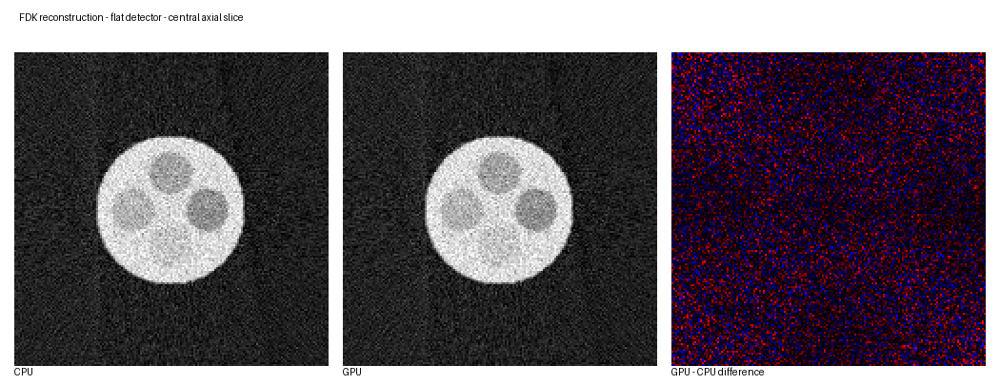

# HelixCT-Recon

**CPU and CUDA implementations of FDK and Katsevich reconstruction for helical cone-beam CT.**

HelixCT-Recon is a C++17/CUDA research and engineering project for reconstructing helical cone-beam CT data. It provides matched CPU and NVIDIA GPU implementations of two substantially different reconstruction pipelines, supports flat and equiangular detector models, and uses consistent geometry and memory conventions across both backends.

The project is intended for reconstruction research, numerical validation, and algorithm development. It is not a complete clinical CT processing pipeline.



## Why this project

- FDK and Katsevich reconstruction implemented on both CPU and CUDA
- Flat/equidistant and equiangular detector geometries
- Signed rotation direction and signed helical travel
- Configurable detector V-center offset and source starting position
- Shared CPU/GPU geometry, interpolation, filtering, and data-layout conventions
- CPU/GPU result validation with published error metrics
- Optional CUDA build: the CPU implementation remains available without a CUDA toolkit
- Plugin-style shared libraries selected through a common reconstruction interface

Measured examples show up to **15.26x observed GPU acceleration**, with close whole-volume agreement between corresponding CPU and GPU results. See [Results and validation](results/README.md) for figures, timings, and numerical metrics.

## Implemented algorithms

### FDK

The FDK path performs detector-geometry pre-weighting, one-dimensional filtering along detector U, bilinear projection sampling, distance-weighted backprojection, and angular integration. It is an approximate helical cone-beam method and is generally the faster choice.

Implemented filters:

- Ram-Lak
- Shepp-Logan
- Cosine
- Hamming
- Hann
- None

### Katsevich

The Katsevich path implements a PI-line formulation for helical cone-beam CT. Its principal stages are:

```text
Directional derivative (G1)
        -> K-line resampling (G2)
        -> Hilbert filtering (G3)
        -> inverse K-line mapping
        -> PI-interval lookup
        -> backprojection
```

A lookup table over one helical pitch avoids repeatedly solving the nonlinear PI-line problem for every voxel during backprojection.

## Detector models

Set `CTGeometry::scan_type` to select the horizontal detector model:

| Value | Model | Meaning of `du` |
|---:|---|---|
| `0` | Flat/equidistant | Physical detector spacing, normally mm/pixel |
| `1` | Equiangular | Fan-angle spacing in rad/pixel |

In both cases, `dv` is the physical vertical spacing. `detectorVCenterOffsetPix` represents a constant sub-pixel displacement of the detector V center.

## Geometry convention

The rotation axis is the world z-axis. For view `i`,

```text
beta(i) = i * angleStep
sourceZ(i) = zStart + i * pitch * abs(angleStep) / (2*pi)
```

Consequently:

- the sign of `angleStep` controls rotation direction;
- the sign of `pitch` controls axial travel as the view index increases;
- `zStart` is the source z-coordinate at view zero.

Katsevich differentiation retains the signed `angleStep`, while final angular integration uses its absolute value. Projection ordering must agree with these conventions.

## Data layout

Projection values are contiguous `float` data with logical shape:

```text
[nViews][nDetV][nDetU]
index = view * nDetV * nDetU + iv * nDetU + iu
```

The output volume uses:

```text
[nz][ny][nx]
index = iz * ny * nx + iy * nx + ix
```

The current voxel grid is centered on the world origin. The caller must allocate projection and volume vectors with sizes matching the configured geometry.

## Projection-data requirements

`Reconstruct()` expects attenuation projections suitable for filtered backprojection. The library does not implement a complete raw-detector preprocessing chain. Depending on the scanner, upstream processing may include:

- offset and air/reference correction;
- `-log(I/I0)` conversion;
- bad-pixel and scatter correction;
- beam-hardening correction;
- scanner-specific calibration.

## Project structure

```text
HelixCT-Recon/
|-- Common/       Geometry, base interface, filtering, FFT, and utilities
|-- ReconCPU/     CPU FDK and Katsevich shared library
|-- ReconGPU/     CUDA FDK and Katsevich shared library
|-- Demo/         Windows DLL-loading example
|-- results/      Images, metrics, logs, and analysis script
|-- CMakeLists.txt
`-- README.md
```

## Requirements

CPU build:

- CMake 3.22 or newer
- C++17 compiler
- Standard C++ threading support

GPU build additionally requires:

- NVIDIA CUDA-capable GPU
- CUDA Toolkit with NVCC

The current demo uses `LoadLibraryA` and is therefore Windows-specific. The reconstruction libraries themselves separate CPU and CUDA code, but other platforms would need a portable loader or direct linkage.

## Build

### CPU and GPU

```bash
cmake -S . -B build -DCTRECON_BUILD_CUDA=ON
cmake --build build --config Release
```

With CMake 3.24 or newer, the default CUDA architecture is the native GPU. A distribution build can specify architectures explicitly, for example:

```bash
cmake -S . -B build -DCTRECON_BUILD_CUDA=ON -DCTRECON_CUDA_ARCHITECTURES="75;86;89"
```

### CPU only

```bash
cmake -S . -B build -DCTRECON_BUILD_CUDA=OFF
cmake --build build --config Release
```

If CUDA is requested but no CUDA compiler is detected, CMake warns and still generates `Common`, `ReconCPU`, and `Demo`.

On multi-configuration generators, binaries are placed under `build/bin/Release` or the selected configuration.

## Public interface

Both backends implement the same abstract interface:

```cpp
class BaseRecon {
public:
    virtual void Reconstruct(
        const std::vector<float>& projection,
        std::vector<float>& volume) = 0;
};
```

The shared libraries expose factory functions:

```cpp
BaseRecon* CreateCpuRecon(
    ReconAlgorithm algorithm,
    const CTGeometry& geometry,
    const recon_para& parameters);

BaseRecon* CreateGpuRecon(
    ReconAlgorithm algorithm,
    const CTGeometry& geometry,
    const recon_para& parameters);

void DestroyReconInstance(BaseRecon* instance);
```

Use `DestroyReconInstance()` from the same module that created the object so allocation and destruction occur across the correct runtime boundary.

## Configuration example

```cpp
CTGeometry geo{};
geo.nDetU = 600;
geo.nDetV = 128;
geo.du = 1.0f;             // mm/pixel for scan_type 0
geo.dv = 1.0f;             // mm/pixel
geo.SDD = 1000.0f;
geo.SID = 500.0f;
geo.pitch = 36.0f;         // mm/turn
geo.nViews = 3200;
geo.angleStep = 0.5f * pi / 180.0f;
geo.zStart = -80.0f;
geo.scan_type = 0;         // 0: flat, 1: equiangular

geo.nx = 165;
geo.ny = 165;
geo.nz = 128;
geo.dx = geo.dy = geo.dz = 1.0f;

recon_para params{};
params.filter_name = "ram-lak";
params.cuda_device = 0;

std::vector<float> projection(
    static_cast<size_t>(geo.nViews) * geo.nDetV * geo.nDetU);
std::vector<float> volume(
    static_cast<size_t>(geo.nz) * geo.ny * geo.nx, 0.0f);

BaseRecon* recon = CreateCpuRecon(ReconAlgorithm::FDK, geo, params);
recon->Reconstruct(projection, volume);
DestroyReconInstance(recon);
```

Valid filter strings are lowercase: `ram-lak`, `shepp-logan`, `cosine`, `hamming`, `hann`, and `none`.

The current demo contains hard-coded input/output paths and geometry values. Replace them before running it with another dataset.

## Validation

CPU and GPU implementations should be compared at intermediate stages as well as at the final volume:

- FDK: pre-weighted projection, filtered projection, reconstructed volume
- Katsevich: K-lines, inverse-psi table, G1/G2/G3, filtered projection, PI lookup table, reconstructed volume

Useful metrics include maximum absolute error, mean absolute error, and relative L2 error. Small differences are expected because CPU and CUDA math functions, intermediate precision, and parallel evaluation order are not identical.

## Limitations

- No complete raw-detector calibration or preprocessing pipeline
- No command-line/configuration interface in the current demo
- Windows-specific dynamic loading in the current demo
- Spatial-domain convolution can be expensive for wide detectors
- A finite detector can truncate measurements required by Katsevich reconstruction
- A constant V-center offset cannot model detector tilt, gantry wobble, or view-dependent calibration
- No automated test suite or continuous integration yet

## Roadmap

- Add command-line or configuration-file input
- Add a small reproducible synthetic projection dataset
- Add unit and regression tests with CPU/GPU tolerances
- Add FFT-based filtering and further CUDA optimization
- Add Linux-compatible loading or direct-link examples
- Add benchmark hardware and compiler metadata automatically

## Results

Reconstruction figures, raw-result metadata, CPU/GPU agreement measurements, and timing summaries are documented in [`results/README.md`](results/README.md).

## License

No license is currently declared. Add an explicit `LICENSE` file before inviting external reuse or contributions.

## Disclaimer

This software is provided for research and engineering evaluation. Validate geometry, normalization, calibration, numerical accuracy, and image quality independently before using it with a physical CT system. It is not certified medical software.

