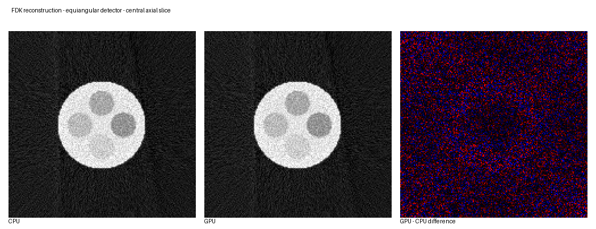
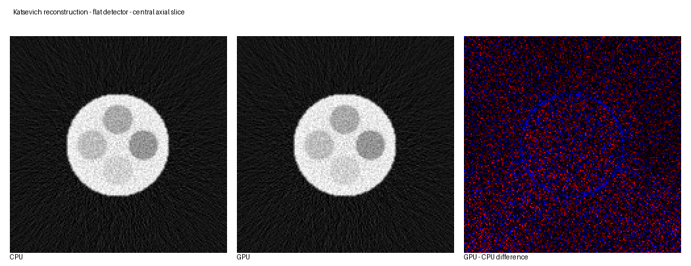
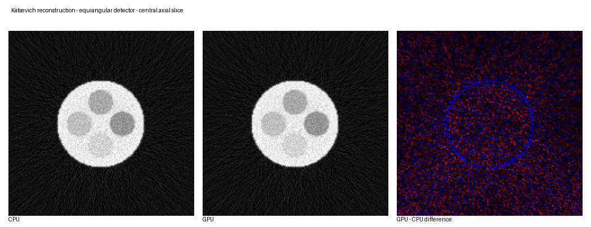

# Reconstruction results and CPU/GPU validation

This directory contains example outputs for the FDK and Katsevich implementations in [HelixCT-Recon](../README.md). Its purpose is to make the reconstruction behavior visible, quantify agreement between the multithreaded CPU and CUDA backends, and preserve the measurements used in the project README.

## Result set

The supplied result set covers all four algorithm/geometry combinations:

| Algorithm | Detector type | CPU result | GPU result |
|---|---|---:|---:|
| FDK | Flat/equidistant (`type 0`) | Yes | Yes |
| FDK | Equiangular (`type 1`) | Yes | Yes |
| Katsevich | Flat/equidistant (`type 0`) | Yes | Yes |
| Katsevich | Equiangular (`type 1`) | Yes | Yes |

Each raw reconstructed volume contains little-endian `float32` values with logical layout `[z][y][x]` and shape `128 x 165 x 165`.

## Visual comparisons

Each figure shows the central axial slice from the CPU volume, the corresponding GPU slice, and a signed GPU-minus-CPU difference map. The difference panel is independently scaled to reveal small numerical differences and therefore should not be interpreted using the grayscale intensity range of the reconstruction.

### FDK — flat/equidistant detector


### FDK — equiangular detector



### Katsevich — flat/equidistant detector



### Katsevich — equiangular detector



## CPU/GPU agreement

The metrics below were calculated over every voxel in each corresponding pair:

| Algorithm | Detector type | Maximum absolute error | Mean absolute error | Relative L2 error |
|---|---:|---:|---:|---:|
| FDK | 0 | 4.650e-7 | 2.674e-8 | 5.392e-6 |
| FDK | 1 | 5.811e-7 | 3.838e-8 | 3.906e-6 |
| Katsevich | 0 | 3.779e-4 | 1.432e-8 | 7.599e-5 |
| Katsevich | 1 | 3.030e-4 | 1.223e-8 | 6.330e-5 |

The corresponding CPU and GPU volumes agree closely. Katsevich has larger isolated maximum errors than FDK, while its mean absolute and relative L2 errors remain small. This indicates localized floating-point differences rather than a general intensity or geometry mismatch.

Machine-readable values are stored in [`cpu_gpu_metrics.csv`](cpu_gpu_metrics.csv).

## Observed execution times

The CPU runs used **20 worker threads**. The speedup values therefore compare CUDA execution against the project's parallel 20-thread CPU backend, not against a single-thread implementation.

### Recorded execution environment

| Component | Configuration |
|---|---|
| CPU | 12th Gen Intel Core i9-12900H |
| CPU parallelism | 20 worker threads |
| GPU | NVIDIA GeForce RTX 4060 Laptop GPU |
| CUDA version | 12.0 |

| Algorithm | Detector type | CPU time | GPU time | Observed speedup |
|---|---:|---:|---:|---:|
| FDK | 0 | 47.199 s | 3.093 s | 15.26x |
| FDK | 1 | 40.787 s | 3.078 s | 13.25x |
| Katsevich | 0 | 20.804 s | 2.355 s | 8.83x |
| Katsevich | 1 | 12.674 s | 2.388 s | 5.31x |

These timings were extracted from the supplied run logs. They are single observed executions rather than a controlled benchmark. The CPU and GPU models, CUDA version, and CPU worker-thread count are known, but the compiler and optimization settings, GPU power configuration, warm-up procedure, and precise timing boundaries were not recorded. The values should therefore be treated as results from this particular setup, not as portable performance claims. Laptop CPU and GPU performance can also vary with thermal and power limits.

Machine-readable values are stored in [`performance_summary.csv`](performance_summary.csv).

## Example acquisition and reconstruction geometry

The supplied demo configuration and logs identify the following primary parameters:

| Parameter | Value |
|---|---:|
| Detector samples | `600 x 128` |
| Projection views | `3200` |
| Source-to-isocenter distance | `500` |
| Source-to-detector distance | `1000` |
| Helical pitch | `36` |
| Angular step | `0.5 degrees/view` |
| Output volume | `165 x 165 x 128` |
| Voxel spacing | `1 x 1 x 1` |
| FDK filter | Ram-Lak |

For detector type 0, `du` is a physical spacing. For detector type 1, `du` is an angular spacing in radians per pixel.

## Files

```text
results/
|-- result_fdk_type0.png
|-- result_fdk_type1.png
|-- result_katsevich_type0.png
|-- result_katsevich_type1.png
|-- cpu_gpu_metrics.csv
|-- performance_summary.csv
|-- analyze_results.py
|-- FDK_type*_CPU.txt
|-- FDK_type*_GPU.txt
|-- Katsevich_type*_CPU.txt
|-- Katsevich_type*_GPU.txt
`-- recon_type*_*.raw           optional release assets
```

The raw volumes are generated binary artifacts. To keep the source repository small, consider attaching them to a GitHub Release instead of committing all of them to ordinary Git history.

## Reproducing the analysis

Keep the eight `.raw` volumes in the same directory as the script and run:

```bash
python analyze_results.py
```

The script expects the filenames supplied with this result set and regenerates:

- four CPU/GPU/difference PNG figures;
- `cpu_gpu_metrics.csv`;
- `performance_summary.csv`.

The script reads the raw volumes but does not modify them.

## Improving benchmark reproducibility

Before publishing these numbers as a formal benchmark, record:

- CPU physical/logical core counts;
- confirmation that all 20 configured worker threads were active;
- RAM and operating system;
- NVIDIA driver version;
- compiler and CMake versions;
- Release/Debug configuration and optimization flags;
- whether file I/O and initialization are included;
- GPU warm-up procedure;
- number of repeated runs and timing variation.

A useful report would present the median of several runs and include either a range or standard deviation.

## Data-use note

Only publish the raw volumes or input projections if the data are synthetic, openly licensed, or owned by you with permission to redistribute them. Do not publish confidential, patient-identifiable, employer-owned, or otherwise restricted scan data.
